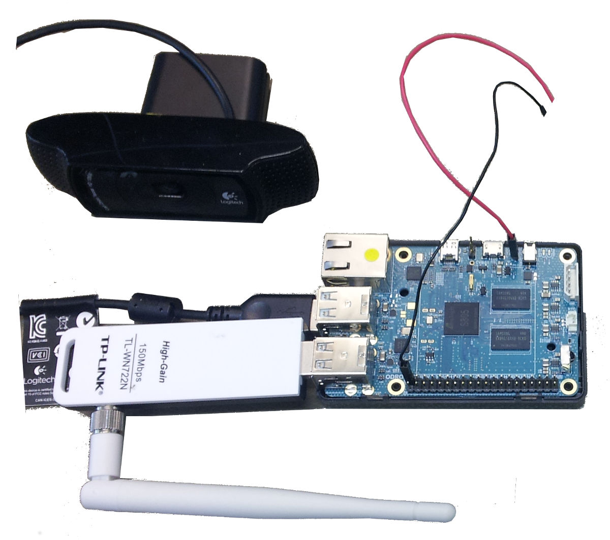
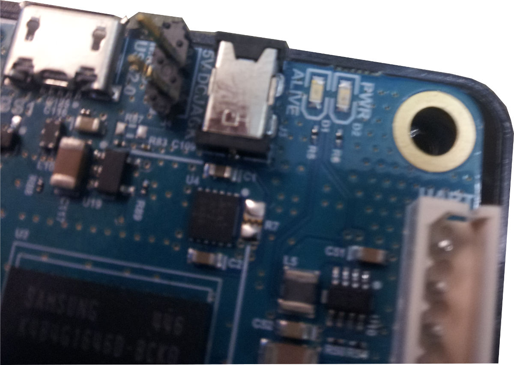

!REDIRECT "https://docs.px4.io/master/bg/qgc/video_streaming.html"

# Video Streaming from Odroid C1 to QGroundControl

> **Tip** This article is somewhat out of date. Community members are encouraged to retest the instructions on a more recent Ubuntu version, and to import Odroid setup instructions into the wiki.

This topic shows how to stream video from a camera (Logitech C920) attached to a companion computer ([Odroid C1](https://magazine.odroid.com/wp-content/uploads/odroid-c1-user-manual.pdf)) to another computer (over wifi) and display in *QGroundControl*.

The hardware setup is shown in the figure below. It consists of the following parts:

* Odroid C1
* Logitech camera C920
* WiFi module TP-LINK TL-WN722N



The instructions were tested on Ubuntu 14.04 but a similar approach should work for later Ubuntu versions.

## Install Linux Environment in Odroid C1

To install the Linux environment (Ubuntu 14.04), follow the instruction given in the [Odroid C1 tutorial](http://web.archive.org/web/20180617111122/http://pixhawk.org/peripherals/onboard_computers/odroid_c1) (wayback machine). The tutorial also shows how to access the Odroid C1 with a UART cable and how to establish Ethernet connection.

## Set up Alternative Power Connection

The Odroid C1 can be powered via the 5V DC jack. If the Odroid is mounted on a drone, it is recommended to solder two pins next to the 5V DC jack by applying the through-hole soldering [method](https://learn.sparkfun.com/tutorials/how-to-solder---through-hole-soldering) as shown in the figure below. The power is delivered by connecting the DC voltage source (5 V) via a jumper cable (red in the image above) with the Odroid C1 and connect the ground of the circuit with a jumper cable (black in the image above) with a ground pin of the Odroid C1 in the example setup.



## Enable WiFi Connection for Odroid C1

In this this tutorial the WiFi module TP-LINK TL-WN722N is used. To enable WiFi connection for the Odroid C1, follow the steps described in the [Odroid C1 tutorial](http://web.archive.org/web/20180617111122/http://pixhawk.org/peripherals/onboard_computers/odroid_c1) in the section Establishing wifi connection with antenna.

## Configure as WiFi Access Point

This sections shows how to set up the Odroid C1 such that it is an access point. The content is taken from the pixhawk.org "access point" tutorial (no longer available) with some small adaptions. To enable to stream the video from the camera via the Odroid C1 to the QGroundControl that runs on a computer it is not required to follow this section. However, it is shown here because setting up the Odroid C1 as an access point allows to use the system in a stand-alone fashion. The TP-LINK TL-WN722N is used as a WiFi module.

In the following steps it is assumed that the Odroid C1 assigns the name wlan0 to your WiFi module. Change all occurrences of wlan0 to the appropriate interface if different (e.g. wlan1).

### Onboard Computer as Access Point

For a more in depth explanation, you can look at [RPI-Wireless-Hotspot](http://elinux.org/RPI-Wireless-Hotspot)

Install the necessary software

```bash
sudo apt-get install hostapd udhcpd
```

Configure DHCP. Edit the file `/etc/udhcpd.conf`

```bash
start 192.168.2.100 # This is the range of IPs that the hotspot will give to client devices.
end 192.168.2.200
interface wlan0 # The device uDHCP listens on.
remaining yes
opt dns 8.8.8.8 4.2.2.2 # The DNS servers client devices will use (if routing through the Ethernet link).
opt subnet 255.255.255.0
opt router 192.168.2.1 # The Onboard Computer's IP address on wlan0 which we will set up shortly.
opt lease 864000 # 10 day DHCP lease time in seconds
```

All other 'opt' entries should be disabled or configured properly if you know what you are doing.

Edit the file `/etc/default/udhcpd` and change the line:

```bash
DHCPD_ENABLED="no"
```

to

```bash
#DHCPD_ENABLED="no"
```

You will need to give the Onboard Computer a static IP address. Edit the file `/etc/network/interfaces` and replace the line `iface wlan0 inet dhcp` (or `iface wlan0 inet manual`) to:

```sh
auto wlan0
iface wlan0 inet static
address 192.168.2.1
netmask 255.255.255.0
network 192.168.2.0
broadcast 192.168.2.255
wireless-power off
```

Disable the original (WiFi Client) auto configuration. Change the lines (they probably will not be all next to each other or may not even be there at all):

```sh
allow-hotplug wlan0
wpa-roam /etc/wpa_supplicant/wpa_supplicant.conf
iface default inet dhcp
```

to:

```sh
#allow-hotplug wlan0
#wpa-roam /etc/wpa_supplicant/wpa_supplicant.conf
#iface default inet dhcp
```

If you have followed the *Odroid C1 tutorial* (originally pixhawk.org) to set up the WiFi connection, you might have created the file `/etc/network/intefaces.d/wlan0`. Please comment out all lines in that file such that those configurations have no effect anymore.

Configure HostAPD: To create a WPA-secured network, edit the file `/etc/hostapd/hostapd.conf` (create it if it does not exist) and add the following lines:

    auth_algs=1
    channel=6            # Channel to use
    hw_mode=g
    ieee80211n=1          # 802.11n assuming your device supports it
    ignore_broadcast_ssid=0
    interface=wlan0
    wpa=2
    wpa_key_mgmt=WPA-PSK
    wpa_pairwise=TKIP
    rsn_pairwise=CCMP
    # Change the to the proper driver
    driver=nl80211
    # Change these to something else if you want
    ssid=OdroidC1
    wpa_passphrase=QGroundControl
    

Change `ssid=`, `channel=`, and `wpa_passphrase=` to values of your choice. SSID is the hotspot's name which is broadcast to other devices, channel is what frequency the hotspot will run on, wpa_passphrase is the password for the wireless network. For many more options see the file `/usr/share/doc/hostapd/examples/hostapd.conf.gz`. Look for a channel that is not in use in the area. You can use tools such as *wavemon* for that.

Edit the file `/etc/default/hostapd` and change the line:

    #DAEMON_CONF=""
    

to:

    DAEMON_CONF="/etc/hostapd/hostapd.conf"
    

Your Onboard Computer should now be hosting a wireless hotspot. To get the hotspot to start on boot, run these additional commands:

    sudo update-rc.d hostapd enable
    sudo update-rc.d udhcpd enable
    

This is enough to have the Onboard Computer present itself as an Access Point and allow your ground station to connect. If you truly want to make it work as a real Access Point (routing the WiFi traffic to the Onboard Computer’s Ethernet connection), we need to configure the routing and network address translation (NAT). Enable IP forwarding in the kernel:

```sh
sudo sh -c "echo 1 > /proc/sys/net/ipv4/ip_forward"
```

To enable NAT in the kernel, run the following commands:

```sh
sudo iptables -t nat -A POSTROUTING -o eth0 -j MASQUERADE
sudo iptables -A FORWARD -i eth0 -o wlan0 -m state --state RELATED,ESTABLISHED -j ACCEPT
sudo iptables -A FORWARD -i wlan0 -o eth0 -j ACCEPT
```

To make this permanent, run the following command:

```sh
sudo sh -c "iptables-save > /etc/iptables.ipv4.nat"
```

Now edit the file /etc/network/interfaces and add the following line to the bottom of the file:

```sh
up iptables-restore < /etc/iptables.ipv4.nat
```

# Gstreamer Installation

To install gstreamer packages on the computer and on the Odroid C1 and start the stream, follow the instruction given in the [QGroundControl README](https://github.com/mavlink/qgroundcontrol/blob/master/src/VideoReceiver/README.md).

If you cannot start the stream on the Odroid with the uvch264s plugin, you can also try to start it with the v4l2src plugin:

```sh
gst-launch-1.0 v4l2src device=/dev/video0 ! video/x-h264,width=1920,height=1080,framerate=24/1 ! h264parse ! rtph264pay ! udpsink host=xxx.xxx.xxx.xxx port=5000
```

Where `xxx.xxx.xxx.xxx` is the IP address where QGC is running.

> **Tip** If you get the system error: `Permission denied`, you might need to prepend `sudo` to the command above.

Alternatively add the current user to the `video` group as shown below (and then logout/login):

    sh
      sudo usermod -aG video $USER

If everything works, you should see the video stream on the bottom left corner in the flight-mode window of *QGroundControl* as shown in the screenshot below.


If you click on the video stream, the satellite map is shown in the left bottom corner and the video is shown in the whole background.